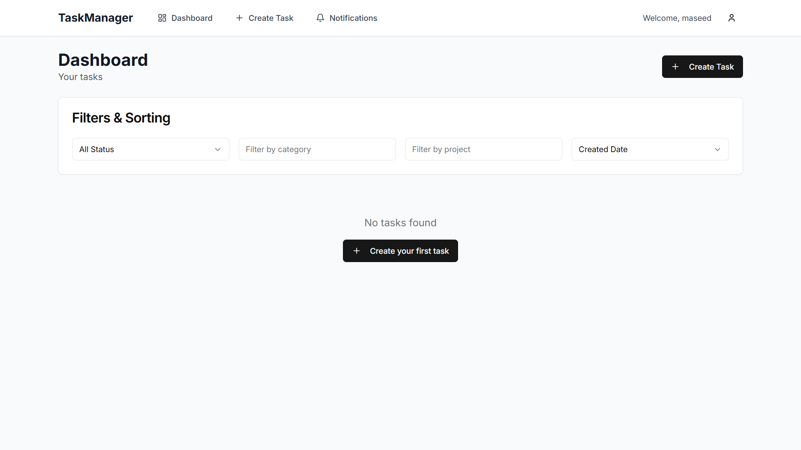
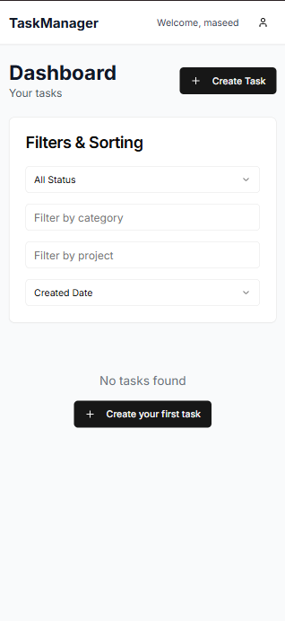
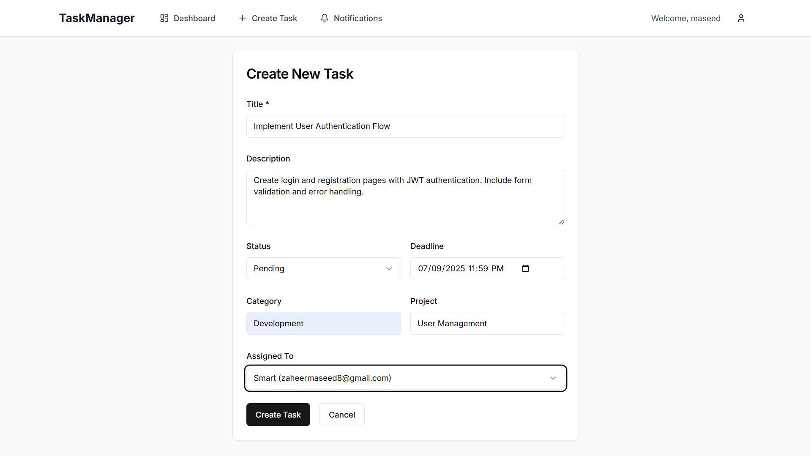
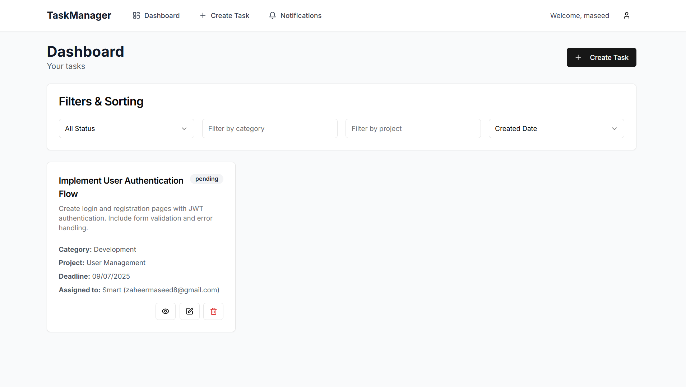
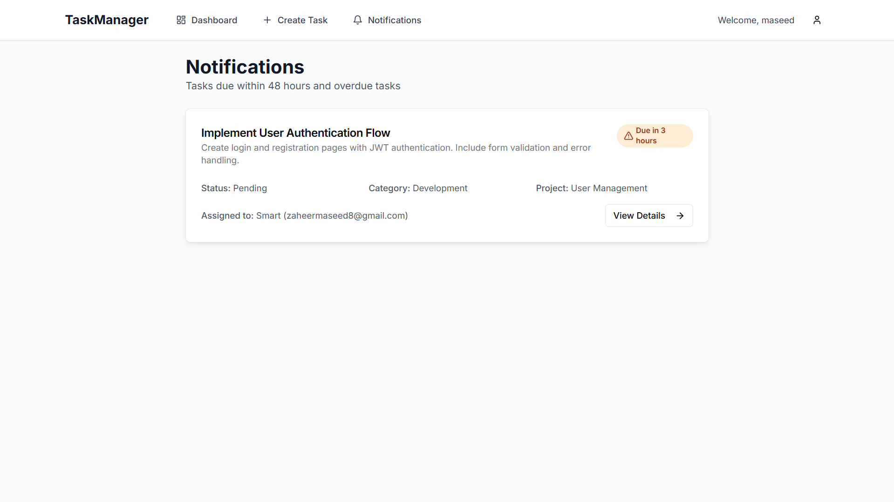
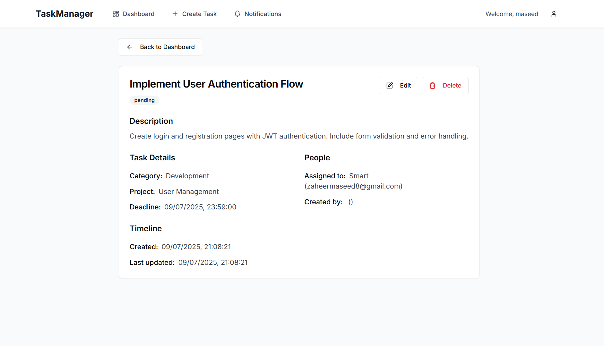

# Task Management System

A full-stack task management application built with Next.js, Node.js, and MongoDB. This project was developed as part of my internship to demonstrate proficiency in modern web development technologies and best practices.

## Features

### User Management
- User authentication (Login/Register)
- Role-based access control (Admin/Regular users)
- Protected routes and API endpoints

### Task Management
- Create, read, update, and delete tasks
- Assign tasks to users
- Set task deadlines and priorities
- Categorize tasks by project and category
- Track task status (pending, in-progress, completed)

### Dashboard & Notifications
- Comprehensive dashboard with task overview
- Real-time notifications for:
  - Overdue tasks
  - Tasks due within 24 hours (urgent)
  - Tasks due within 48 hours (upcoming)
- Filter tasks by status, category, and project
- Sort tasks by creation date or deadline

### User Interface
- Modern, responsive design using Tailwind CSS
- Dynamic form validation
- Loading states and error handling
- Intuitive navigation
- Mobile-friendly layout

## Technology Stack

### Frontend
- Next.js 13+ (React framework)
- TypeScript
- Tailwind CSS
- Shadcn UI Components
- Axios for API requests
- React Context for state management

### Backend
- Node.js
- Express.js
- MongoDB with Mongoose
- JWT for authentication
- RESTful API architecture

## Project Structure

```
task-manager/
├── client/                 # Frontend Next.js application
│   ├── app/               # Next.js 13 app directory
│   ├── components/        # Reusable React components
│   ├── contexts/          # React Context providers
│   ├── lib/              # Utility functions and API setup
│   └── public/           # Static assets
│
└── server/                # Backend Node.js application
    ├── controllers/      # Route controllers
    ├── middleware/       # Custom middleware
    ├── models/          # Mongoose models
    └── routes/          # API routes
```

## Key Implementations

1. **Authentication System**
   - JWT-based authentication
   - Secure password hashing
   - Protected routes with middleware

2. **Real-time Task Updates**
   - Efficient task filtering and sorting
   - Deadline-based notification system
   - Optimistic UI updates

3. **Data Management**
   - MongoDB with Mongoose for data modeling
   - RESTful API design
   - Proper error handling

4. **User Experience**
   - Form validation
   - Loading states
   - Error feedback
   - Responsive design

## Installation and Setup

1. Clone the repository:
   ```bash
   git clone https://github.com/zaheer037/TaskManagement.git
   ```

2. Setup Backend:
   ```bash
   cd server
   npm install
   # Create .env file with required environment variables
   npm start
   ```

3. Setup Frontend:
   ```bash
   cd client
   npm install
   npm run dev
   ```

4. Required Environment Variables:
   ```
   # Server (.env)
   MONGODB_URI=your_mongodb_connection_string
   JWT_SECRET=your_jwt_secret
   PORT=5000

   # Client (.env.local)
   NEXT_PUBLIC_API_URL=http://localhost:5000
   ```

## Learning Outcomes

- Implemented full-stack JavaScript/TypeScript development
- Worked with modern frameworks and libraries
- Applied best practices in:
  - Code organization
  - Error handling
  - State management
  - User authentication
  - Database design
- Developed responsive and user-friendly interfaces
- Implemented real-time features and notifications

## Future Enhancements

- Real-time updates using WebSocket
- Task comments and attachments
- Email notifications
- Advanced task analytics
- Team management features
- Calendar integration

## Screenshots

### Authentication
- Login and Registration interfaces showing form validation and error states
<div style="display: flex; gap: 20px; margin-bottom: 20px;">
    
    
</div>

### Dashboard
- Main task overview with filtering and sorting capabilities
<div align="center">
  
  
  <h4>Mobile responsive view</h4>
  
</div>

### Task Management
- Task creation and editing interfaces

- Task details view


### Notifications
- Notification center showing different urgency levels

- Task deadline indicators


<!-- ### Responsive Design
- Mobile navigation and layout adaptations


### User Experience
- Interactive elements and state changes
 -->

## Contact

Maseed Zaheer
- Email: [jaheermaseed@gmail.com]
- LinkedIn: [https://www.linkedin.com/in/zaheer-maseed/]
- GitHub: [https://github.com/zaheer037]

---
*This project was developed as part of the CSI internship program, May - July.*
